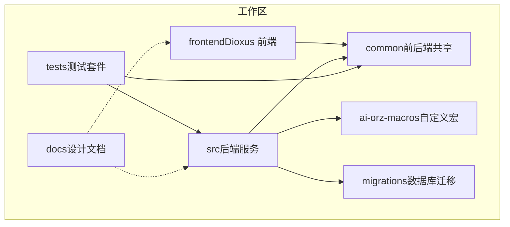
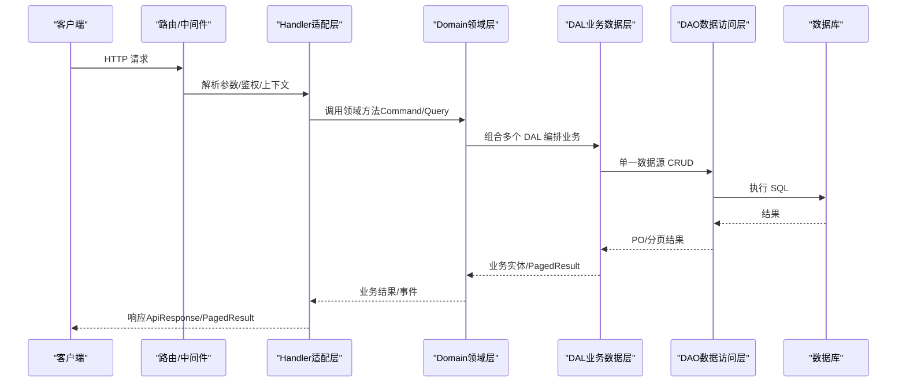
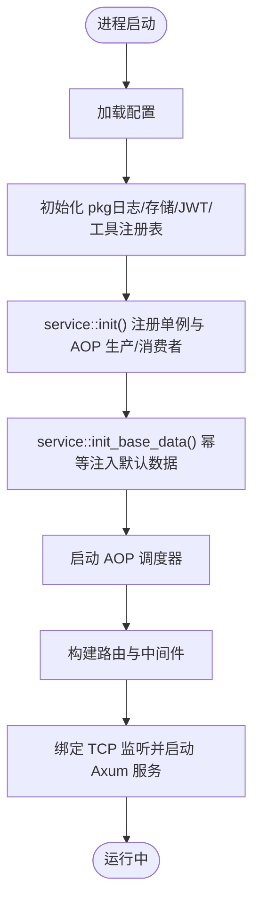
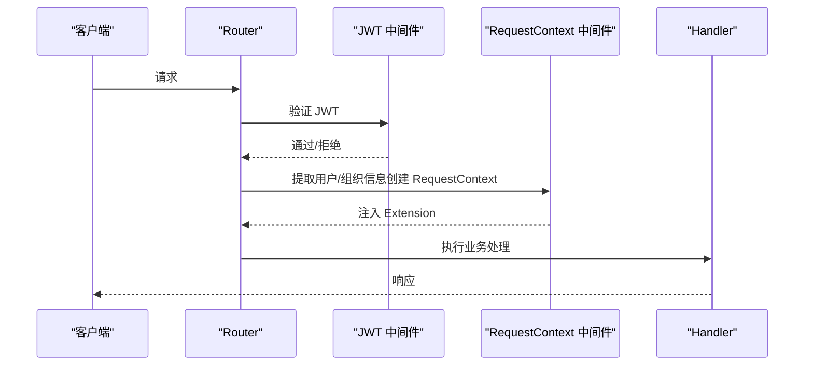
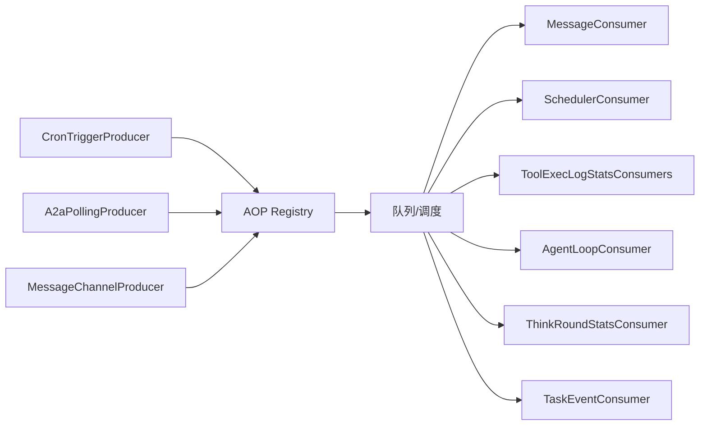
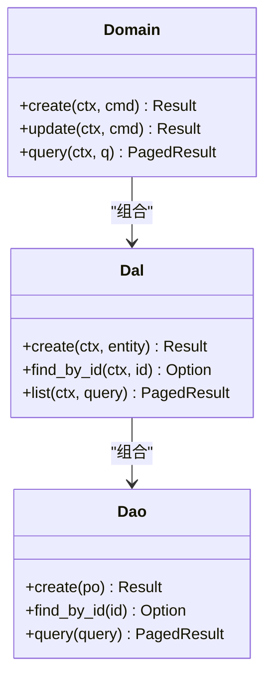
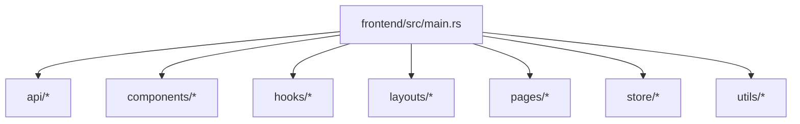
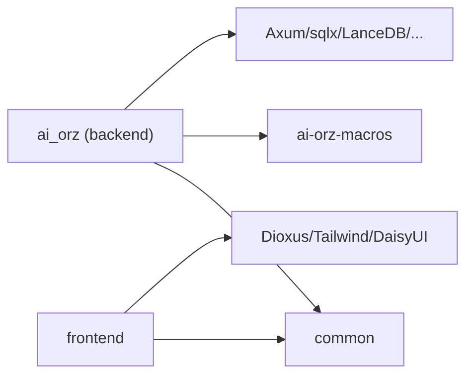

# 项目结构说明

<cite>
**本文引用的文件**
- [Cargo.toml](Cargo.toml)
- [src/main.rs](src/main.rs)
- [src/lib.rs](src/lib.rs)
- [src/router.rs](src/router.rs)
- [src/service/mod.rs](src/service/mod.rs)
- [src/handlers/mod.rs](src/handlers/mod.rs)
- [src/producer/mod.rs](src/producer/mod.rs)
- [src/consumer/mod.rs](src/consumer/mod.rs)
- [common/Cargo.toml](common/Cargo.toml)
- [common/src/lib.rs](common/src/lib.rs)
- [common/src/api/mod.rs](common/src/api/mod.rs)
- [frontend/Cargo.toml](frontend/Cargo.toml)
- [frontend/src/main.rs](frontend/src/main.rs)
- [docs/ARCHITECTURE.md](docs/ARCHITECTURE.md)
- [AGENTS.md](AGENTS.md)
- [migrations/20260819000000_user_credentials.sql](migrations/20260819000000_user_credentials.sql)
- [src/models/user_credential.rs](src/models/user_credential.rs)
- [src/service/dao/user_credential/mod.rs](src/service/dao/user_credential/mod.rs)
- [tests/e2e/](tests/e2e/)

### 本文关联的设计/计划文档
- [用户身份凭证独立表设计](docs/design/user_credentials_design.md) — user_credentials 表结构
- [用户身份凭证独立表落地](docs/plan/用户身份凭证独立表落地.md) — 迁移步骤与 DAO/DAL 变更
</cite>

## 更新摘要
**变更内容（2026-08-19 增量更新）**
- 新增迁移脚本：`migrations/20260819000000_user_credentials.sql`（用户凭证独立表建表 + 索引 + 数据搬迁）
- 新增模型文件：`src/models/user_credential.rs`（UserCredentialPo/业务实体）
- 新增 DAO 模块：`src/service/dao/user_credential/mod.rs`（一表一 DAO 模式）
- 新增 E2E 测试目录：`tests/e2e/`
- 更新项目结构图：反映新模块与目录

## 目录
1. [简介](#简介)
2. [项目结构](#项目结构)
3. [核心组件](#核心组件)
4. [架构总览](#架构总览)
5. [详细组件分析](#详细组件分析)
6. [依赖关系分析](#依赖关系分析)
7. [性能与可维护性](#性能与可维护性)
8. [故障排查指南](#故障排查指南)
9. [结论](#结论)
10. [附录：命名约定与最佳实践](#附录：命名约定与最佳实践)

## 简介
AI Orz 是一个全栈 Rust 多 Agent 协作框架，采用严格四层单向调用（适配层 → 领域层 → 业务数据层 → 数据访问层），通过 AOP 事件中心实现异步解耦，后端使用 Axum + SQLite/sqlx，前端使用 Dioxus（WASM）+ Tailwind CSS v4 + DaisyUI v5。仓库以 Cargo workspace 组织，包含 common（前后端共享）、src（后端主程序）、frontend（Dioxus 前端应用）、migrations（数据库迁移）、docs（设计文档）、tests（测试套件）等顶级目录。

## 项目结构
整体采用三级 cargo workspace：
- common：前后端共享的 API DTO、枚举、错误类型、配置等
- ai-orz-macros：日志宏、统计事件宏等自定义宏 crate
- src：后端服务（Axum HTTP、AOP 生产者/消费者、service 分层、pkg 基础设施）
- frontend：Dioxus 前端应用（路由、页面、组件、状态管理、API 客户端）
- migrations：按时间戳命名的 SQL 迁移脚本
- docs：架构与设计文档（事实来源）
- tests：集成测试与单元测试

图表来源
- [Cargo.toml:1-7](Cargo.toml#L1-L7)
- [common/Cargo.toml:1-34](common/Cargo.toml#L1-L34)
- [frontend/Cargo.toml:1-26](frontend/Cargo.toml#L1-L26)

章节来源
- [Cargo.toml:1-7](Cargo.toml#L1-L7)
- [common/Cargo.toml:1-34](common/Cargo.toml#L1-L34)
- [frontend/Cargo.toml:1-26](frontend/Cargo.toml#L1-L26)

## 核心组件
- 启动入口：main.rs 仅委托到 lib.rs 的 run()，避免重复编译；run() 完成配置加载、pkg 初始化、service 初始化、AOP producer/consumer 注册、基础数据注入、AOP 调度器启动、Axum 服务器绑定与监听。
- 路由与中间件：router.rs 定义公开/受保护路由、A2A 协议路由、静态资源 fallback，并保证中间件顺序（JWT 外层先执行，RequestContext 内层后执行）。
- Service 分层：service/mod.rs 提供 init() 与 init_base_data() 两阶段初始化，分别负责单例/静态注册与幂等默认数据注入。
- AOP 事件中心：producer/mod.rs 注册轮询/外部接入的生产者；consumer/mod.rs 注册消息、定时任务、工具执行日志/统计、Agent 循环、思考轮次统计、任务事件等消费者。
- 共享类型：common/src/api/mod.rs 统一 ApiResponse、PagedResult、PaginationParams 等，前后端共用，确保契约一致。

章节来源
- [src/main.rs:1-5](src/main.rs#L1-L5)
- [src/lib.rs:114-175](src/lib.rs#L114-L175)
- [src/router.rs:12-59](src/router.rs#L12-L59)
- [src/service/mod.rs:1-24](src/service/mod.rs#L1-L24)
- [src/producer/mod.rs:1-27](src/producer/mod.rs#L1-L27)
- [src/consumer/mod.rs:1-43](src/consumer/mod.rs#L1-L43)
- [common/src/api/mod.rs:1-156](common/src/api/mod.rs#L1-L156)

## 架构总览
严格四层单向调用：Adapter（HTTP Handler / 公开回调 Handler / AOP Producer）→ Domain → DAL → DAO，禁止跨层与同层互调。PO 仅在 DAO/DAL 内部使用，Domain 输入为 Command/Query，输出为业务实体与内部事件。所有 service 层公共方法首参为 RequestContext，跨层传递使用 ctx.clone()。

图表来源
- [src/router.rs:12-59](src/router.rs#L12-L59)
- [src/service/mod.rs:1-24](src/service/mod.rs#L1-L24)
- [common/src/api/mod.rs:1-156](common/src/api/mod.rs#L1-L156)

章节来源
- [docs/ARCHITECTURE.md:150-186](docs/ARCHITECTURE.md#L150-L186)
- [AGENTS.md:148-186](AGENTS.md#L148-L186)

## 详细组件分析

### 启动流程与两阶段初始化
- 第一阶段（同步）：配置加载 → pkg 初始化 → service::init() 注册单例与 AOP producer/consumer → 启动 AOP 调度器。
- 第二阶段（异步）：service::init_base_data() 幂等注入默认基础数据（如系统级 cron triggers），失败仅记录 warn。

图表来源
- [src/lib.rs:114-175](src/lib.rs#L114-L175)
- [src/service/mod.rs:1-24](src/service/mod.rs#L1-L24)

章节来源
- [src/lib.rs:114-175](src/lib.rs#L114-L175)
- [src/service/mod.rs:1-24](src/service/mod.rs#L1-L24)

### HTTP 路由与中间件顺序
- 公开路由：系统初始化、登录/登出、组织列表等，无需 JWT。
- 受保护路由：所有业务接口，需 JWT 认证。
- A2A 协议路由：agent card（仅需 RequestContext）、JSON-RPC（JWT 保护）、subscribe（JWT 保护）、callback（公开回调）。
- 中间件顺序：jwt_auth_middleware（外层，先执行）→ request_context_middleware（内层，后执行），确保 RequestContext 能读取 JWT 注入的用户信息。

图表来源
- [src/router.rs:12-59](src/router.rs#L12-L59)
- [src/router.rs:96-136](src/router.rs#L96-L136)

章节来源
- [src/router.rs:12-59](src/router.rs#L12-L59)
- [src/router.rs:96-136](src/router.rs#L96-L136)

### AOP 事件中心（生产者/消费者）
- 生产者：cron_trigger、a2a_polling、message_channel 等，将外部事件或定时任务投递到事件总线。
- 消费者：message、scheduler、tool_exec_log/stats、agent_loop、think_round_stats、task_event 等，消费 Domain 产生的内部事件。
- 运行时：AOP 调度器轮询生产者并驱动异步消费者 worker，支持优先级、顺序键、崩溃恢复。

图表来源
- [src/producer/mod.rs:1-27](src/producer/mod.rs#L1-L27)
- [src/consumer/mod.rs:1-43](src/consumer/mod.rs#L1-L43)

章节来源
- [src/producer/mod.rs:1-27](src/producer/mod.rs#L1-L27)
- [src/consumer/mod.rs:1-43](src/consumer/mod.rs#L1-L43)

### Service 分层（DAO/DAL/Domain）
- DAO：单一数据源操作（SQLite/文件/外部 API 出站），面向多态（接口与多种实现）。
- DAL：组合多个 DAO，提供业务级数据操作，PO ↔ 业务实体转换。
- Domain：核心业务规则编排，组合多个 DAL，产生内部事件；所有公共方法首参为 RequestContext。

图表来源
- [docs/ARCHITECTURE.md:325-352](docs/ARCHITECTURE.md#L325-L352)
- [AGENTS.md:299-321](AGENTS.md#L299-L321)

章节来源
- [docs/ARCHITECTURE.md:325-352](docs/ARCHITECTURE.md#L325-L352)
- [AGENTS.md:299-321](AGENTS.md#L299-L321)

### 前端（Dioxus）结构
- 入口：frontend/src/main.rs 启动 App，提供全局状态（AuthState、Toast、主题、移动端检测）。
- 模块：api（统一 API 客户端）、components（UI 组件库）、hooks（use_resource/use_workspace_data 等）、layouts（AppLayout/Navbar）、pages（按业务域分组）、store（auth/toast）、utils（time/file/message/status）。
- 构建：build.rs 自动 npm install 与 Tailwind CSS 编译，package.json 管理样式依赖。

图表来源
- [frontend/src/main.rs:1-58](frontend/src/main.rs#L1-L58)
- [frontend/Cargo.toml:1-26](frontend/Cargo.toml#L1-L26)

章节来源
- [frontend/src/main.rs:1-58](frontend/src/main.rs#L1-L58)
- [frontend/Cargo.toml:1-26](frontend/Cargo.toml#L1-L26)

### 共享代码（common）
- 职责：前后端共用的 API DTO、枚举、错误类型、配置、模型等，消除重复定义，确保类型安全与契约一致。
- 关键类型：ApiResponse<T>、PagedResult<T>、PaginationParams，以及各业务域的 DTO 子模块。

章节来源
- [common/src/lib.rs:1-19](common/src/lib.rs#L1-L19)
- [common/src/api/mod.rs:1-156](common/src/api/mod.rs#L1-L156)
- [common/Cargo.toml:1-34](common/Cargo.toml#L1-L34)

## 依赖关系分析
- 工作区成员：backend（ai_orz）、frontend、common、ai-orz-macros。
- 后端依赖：Axum 0.8、sqlx 0.8（SQLite）、DuckDB、LanceDB、fastembed、tracing、tokio 等。
- 前端依赖：Dioxus 0.7（wasm）、reqwest、web-sys、Tailwind CSS v4 + DaisyUI v5。
- common 被 backend 与 frontend 共同引用，作为契约层。

图表来源
- [Cargo.toml:1-7](Cargo.toml#L1-L7)
- [Cargo.toml:17-71](Cargo.toml#L17-L71)
- [common/Cargo.toml:1-34](common/Cargo.toml#L1-L34)
- [frontend/Cargo.toml:1-26](frontend/Cargo.toml#L1-L26)

章节来源
- [Cargo.toml:1-7](Cargo.toml#L1-L7)
- [Cargo.toml:17-71](Cargo.toml#L17-L71)
- [common/Cargo.toml:1-34](common/Cargo.toml#L1-L34)
- [frontend/Cargo.toml:1-26](frontend/Cargo.toml#L1-L26)

## 性能与可维护性
- 向量搜索：默认 LanceDB，支持 HNSW/InMemory/SqliteVss 多后端降级；FTS5 + trigram 全文搜索。
- 统计：DuckDB 多维统计 + 内存运行时收集器（AOP 已接入）。
- 并发与顺序：AOP 事件按 priority 与 order_key 排序，相同 key 顺序锁保证顺序。
- 可维护性：严格分层、PO 不暴露到 Domain、统一分页与 count、统一日志宏、clippy -D warnings 零容忍、覆盖率门槛 PR 38%/main 45%。

章节来源
- [docs/ARCHITECTURE.md:229-243](docs/ARCHITECTURE.md#L229-L243)
- [AGENTS.md:14-18](AGENTS.md#L14-L18)
- [AGENTS.md:499-582](AGENTS.md#L499-L582)
- [AGENTS.md:585-755](AGENTS.md#L585-L755)

## 故障排查指南
- 启动失败：检查配置加载、pkg 初始化、service::init() 与 service::init_base_data() 是否成功；关注 AOP 调度器启动日志。
- 认证问题：确认中间件顺序（JWT 外层先于 RequestContext 内层），受保护路由必须携带有效 JWT。
- 事件未消费：检查 producer/consumer 是否注册到 AOP registry，队列是否有 pending 事件，order_key 是否正确。
- 向量/全文搜索：确认 Vectorizable 实现与 collection 名，无 embedding provider 时走降级逻辑。
- 分页异常：确保使用 PaginationParams/PagedResult，DAO 层 push_query_filters 复用 COUNT/LIST。

章节来源
- [src/lib.rs:114-175](src/lib.rs#L114-L175)
- [src/router.rs:96-136](src/router.rs#L96-L136)
- [src/producer/mod.rs:1-27](src/producer/mod.rs#L1-L27)
- [src/consumer/mod.rs:1-43](src/consumer/mod.rs#L1-L43)
- [AGENTS.md:585-755](AGENTS.md#L585-L755)

## 结论
AI Orz 通过严格的四层架构与 AOP 事件中心，实现了高内聚、低耦合、可扩展的多 Agent 协作框架。common 保障前后端契约一致性，service 分层清晰，pkg 提供无业务感知的通用能力。配合完善的迁移、文档与测试体系，具备良好的可维护性与演进能力。

## 附录：命名约定与最佳实践
- 命名规范：变量/函数 snake_case；类型/枚举 Trait PascalCase；常量 SNAKE_CASE；文件名 snake_case；Trait 不加 Trait 后缀，实现加 Impl 后缀。
- 方法前缀：get_/new_/create_/update_/delete_/find_all/find_by_/is_/has_/can_ 等。
- Context 传递：所有 service 层公共方法首参为 RequestContext，跨层使用 ctx.clone()。
- PO 与业务实体：PO 仅在 DAO/DAL 内部使用；业务实体内部持有 PO 字段，DAL 对外使用业务实体。
- 分页与计数：统一 PaginationParams/PagedResult；count 与 query 复用过滤逻辑。
- 向量化：所有可索引实体实现 Vectorizable trait，collection 名通过 trait 获取。
- 日志：统一使用 log_info!/log_warn!/log_error!/log_debug!，禁止直接调用 tracing。

章节来源
- [AGENTS.md:257-298](AGENTS.md#L257-L298)
- [AGENTS.md:299-321](AGENTS.md#L299-L321)
- [AGENTS.md:395-452](AGENTS.md#L395-L452)
- [AGENTS.md:453-498](AGENTS.md#L453-L498)
- [AGENTS.md:499-582](AGENTS.md#L499-L582)
- [AGENTS.md:585-755](AGENTS.md#L585-L755)