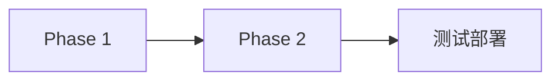

# 项目管理

项目管理技能是在模拟人类团队的「项目制工作法」：把复杂工作拆成可落地的「任务」、排好先后顺序（DAG 依赖 = 先做 A 才能做 B）、指派合适的人（Agent）去做、定期追进度（progress 0→100 = 项目经理每周开周会）、把交付物归档保存（Artifact = 项目文档/设计稿/代码提交/测试报告）。Project Owner 就像项目经理（PM）——对最终交付负责拆分和全局调度；Task Owner 就像负责某个模块的工程师——把分配的任务做完、有阻塞就问 PM、交付时附交付物。**execution_plan 是你开干前写的「我准备怎么做」，execution_result 是你干完后写的「我实际做了什么 + 交付了什么 + 有哪些坑」**——这些不只是给别人看的，也是未来你自己或其他同事接手时能快速读懂背景的「工作交接单」。

**核心协作模型**：Project Owner 主导（拆解 / 分配 / 调度 / 收尾）+ Task Owner 执行（完成 / 上报）两层结构。协作查询类工具（`query_agents` / `search_agents` / `list_agents` / `get_agent` / `get_reception_agent`）默认是用户 / 前端入口，**不在你的 neural 面板中**；候选 Agent ID 通过用户、前台 Agent 或项目上下文获取。

本技能工具 tags 为 `project_management` / `file_management`，非 neural——加载 / 安装规则见「技能管理」技能（`install_skill_pack(tag=project_management)` 可整包安装）。

## 层次结构

```
Project（项目，顶层容器，有 owner_agent_id）
  └─► Task（任务：状态、进度 0-100、负责人、DAG 依赖）
       └─► Artifact（产物：GeneratedContent 独立存储 / Attachment 引用附件）
```

## 项目管理

### 项目状态机

| 状态 | 值 | 说明 |
|------|---|------|
| `Deleted` | 0 | 软删除，**不可通过状态接口设置**，必须走删除 action |
| `Active` | 1 | 活跃（默认） |
| `PendingReview` | 2 | Agent 创建后待用户审核 |
| `InProgress` | 3 | 进行中，自动填入 `start_at` |
| `Completed` | 4 | 已完成，自动填入 `end_at` |
| `Archived` | 5 | 已归档 |

```
Active        → PendingReview / InProgress / Archived
PendingReview → Active / InProgress / Archived
InProgress    → Completed / Archived
Completed     → InProgress（项目重启专用）/ Archived
相同状态 → no-op；其它 → 非法
```

### 工具速览

- **`create_project`**：`name` 必填，可选 `description` / `priority` / `tags` / `owner_agent_id`（**纯透传**，后端不调 `resolve_agent`）。Agent 创建的项目默认 `PendingReview` 待用户审核。
- **`get_project(id)`**：统计选项 `with_stats` / `with_model_call_stats` / `stats_time_start`+`stats_time_end`（毫秒，须同时存在）/ `stats_interval(hourly|daily)`；可选 `with_task_graph`（Mermaid 依赖图）/ `with_artifacts` / **`with_progress_summary`**。
  - `with_progress_summary=true` 实时计算不持久化：`total_tasks` / 各状态计数（completed/in_progress/pending/blocked/cancelled）/ `overall_percent`（Σ task.progress / total）。**Owner 跟进进度务必开启，无需自己逐任务计算**。
- **`list_projects`**：仅分页；固定过滤 `root_user_id = ctx.uid()`，排除 `status=0`，按 `priority DESC, created_at DESC`。
- **`query_projects`**：POST body——`ids` / `keyword` / `root_user_id` / `status_in`（OR 语义）/ `pagination`。
- **`update_project`**：全部可选 `name` / `description` / `priority` / `tags` / `execution_plan` / `execution_result`（书写规范见下文统一章节）。另可更新预留字段 `last_followup_at`（巡检时间，系统后续会自动注入，现在主动填写有助于调度节奏）。
- **`update_project_status(status)`**：不能设为 `Deleted`。

## 任务管理

### 任务状态机

| 状态 | 值 | 说明 |
|------|---|------|
| `Cancelled` | 0 | 取消（相当于删除），**不可通过状态接口设置** |
| `PendingReview` | 1 | Agent 创建后待用户审核 |
| `Pending` | 2 | 待启动（默认） |
| `InProgress` | 3 | 进行中，自动填入 `start_at` |
| `Completed` | 4 | 已完成，自动填入 `end_at` |
| `Archived` | 5 | 总结后归档 |

```
PendingReview → Pending / InProgress / Archived
Pending       → InProgress / Archived
InProgress    → Completed / Archived
Completed     → Archived
相同状态 → no-op；其它 → 非法（返回 InvalidRequest）
```

负责人类型（`AssigneeType`）：`User = 0` / `Agent = 1`（默认）。

### 工具速览

- **`create_task`**：`title`、`assignee_id` 必填；可选 `description` / `priority` / `tags` / `root_user_id`（默认当前用户）/ `assignee_type`（默认 Agent）/ `project_id` / `due_at`（毫秒）/ `dependencies`（DAG）。
  - **关键副作用**：`assignee_type = Agent` 时自动给目标 Agent 发任务分配通知（`send_task_assignment`），通知失败不影响创建。
- **`get_task(id)`**：统计选项同项目；`with_artifacts` 一并返回关联产物；返回含 `thinking_depth` / `progress` / `created_by` / `modified_by` / `dependencies`。
- **`list_tasks`**：仅分页，固定排除 `status=0`，`priority DESC, created_at DESC`。
- **`list_project_tasks(project_id)`** / **`list_agent_tasks(agent_id)`**：均可选 `status` / `limit`；后者用于查看某 Agent 的待办。
- **`query_tasks`**：POST body——`ids` / `keyword` / `project_id` / `assignee_type` / `assignee_id` / `status_in` / `pagination`。
- **`update_task`**：全部可选 `title` / `description` / `priority` / `tags` / `due_at` / `dependencies` / `execution_plan` / `execution_result`。
- **`update_task_status(status)`**：不能设为 `Cancelled`；严格按状态机，非法转换返回 `InvalidRequest`。
- **`update_task_progress(progress)`**：自动 clamp 到 [0, 100]，触发 `TaskEvent(progress_updated)`。
- **`mark_done(task_id, summary?)`**：**绕过状态机**，直接设 `status=Completed` + `progress=100` + `end_at`，适合快速闭环；需严格校验用 `update_task_status(Completed)`。

## execution_plan / execution_result 书写规范

前端按 **Markdown** 渲染（支持表格、任务清单、```mermaid 代码块画流程图 / 甘特图 / 依赖图），请用 Markdown 书写，让计划与结果可视化、易读。

**时机（强制）**：
- `execution_plan`——项目由 Owner 在启动前写（`update_project`），任务由 Task Owner 在 InProgress 前写（`update_task`）；阶段 / 方案有重大调整时**立即更新**，让 Owner 与系统巡检看到思路变化。
- `execution_result`——项目收尾（Owner）或任务完成 / 阻塞（Task Owner）时写入。

**plan 示例（分阶段 + 占比 + 风险，越具体越好，别只写一句「我先看看怎么做」）**：

```markdown
## Phase 1: 项目脚手架（3 天，预计 5 个任务）
- [ ] Task-A: 前端 Dioxus 初始化 + 路由 + 状态管理
- [ ] Task-B: 后端 Axum 分层 + SQLite/sqlx 接入
- [ ] Task-C: 鉴权（JWT + HttpOnly Cookie）- 依赖 Task-B

## Phase 2: 核心功能...
### 阶段依赖

```

**result 示例（完成情况 → 产出物清单 → 遗留与风险必填）**：

```markdown
## 完成情况
- handlers/xxx 路由 3 个端点全部实现并自测通过（对照 plan 逐步说明，未完成的写差什么、为什么）

## 产出物清单
- Artifact: 测试报告.md（id=art-xxx）
- Artifact: 接口说明.md（id=art-yyy）

## 遗留与风险（必填）
- upload_file 超 10MB 可能报错（超 64KB 文本附件限制），建议后续接入分片上传

## 下一步建议（可选）
- 建议启动 Task-yyy（task_id=tsk-zzz），原因：...
```

## 产物管理

### 来源类型与文件类型

| 来源类型 | 值 | 存储方式 | 内容更新 |
|---------|---|---------|---------|
| `Attachment` | 1（默认） | 不复制内容，引用 `attachments/{relative_path}` | ❌ 不能直接更新内容（须改原附件） |
| `GeneratedContent` | 2 | 独立写入产物存储 | ✅ 可更新内容 |
| `RemoteUrl` | 3 | 预留，当前返回 `Unsupported` | — |

文件类型：`Document=0`（默认，文本类）/ `Image=1` / `Audio=2` / `Video=3` / `Binary=4`。

### 工具速览

- **`create_text_artifact`**：`project_id`、`name`、`content`（≤1MB）必填；可选 `task_id`（None = 项目级产物）/ `description` / `file_name`（默认 `{name}.md`）/ `mime_type`（默认 text/plain）/ `file_type`（默认 Document）/ `tags`。适用：报告、方案、设计文档、代码片段、分析结论。
- **`register_artifact_from_path`**：将工作目录文件**复制**注册为产物，源文件保留。`project_id`、`name`、`source_path`（**相对你的工作目录**）必填；其余同上（`file_name` 默认取 basename，mime / file_type 按扩展名推断）。约束：仅 Agent 可调用；`source_path` 必须是文件不能是目录；经 `canonicalize + starts_with` 校验必须在 `agents/{agent_id}/` 之下（路径穿越拒绝）；失败自动回滚产物记录。
- **`create_artifact`**：按 `source_type` 分支。Attachment 模式需 `attachment_id`（不能带 content / file_name / mime_type），跨 Domain 读附件后**仅建立引用关系不复制内容**（存储仍在 Finance Attachment 模块）；GeneratedContent 模式需 `content` + `file_name`。公共：`project_id` 必填 / `task_id` / `name` / `description` / `mime_type` / `file_type` / `tags`。
- **`update_artifact`**：统一部分更新，**仅 `Some` 字段生效**。`content` 仅 GeneratedContent 可用（≤1MB）；`name` trim 后非空；`expected_updated_at` 乐观锁（不匹配返回 409 Conflict，重新加载后再试）；元数据更新适用所有类型。
- **`query_artifacts`**：`project_id` / `task_id` / `file_type` / `source_type` / `pagination`。用于了解团队已有产出、避免重复创建。

**产物创建选择**：

| 场景 | 推荐工具 |
|------|---------|
| 报告 / 方案 / 文档（≤1MB 文本） | `create_text_artifact` |
| 工作目录大文件 / 二进制 | `register_artifact_from_path` |
| 已上传到附件系统的文件 | `create_artifact`（Attachment 模式） |

## 附件管理（Finance Domain，64KB 文本限制）

**关键约束**：文本 ≤64KB；文件名不能含 `/` `\` `..`、不能是绝对路径；文本附件 `file_type` 必须是 `Document` 且 mime 为 text 类（`text/*` / json / yaml / toml / xml / javascript 等）；权限 `attachment.root_user_id == ctx.uid()`，非 owner 返回 `NotFound`（避免泄露存在性）；`delete_attachment` 为软删除。

工具：**`create_text_attachment`**（`file_name` / `content` ≤64KB 必填，可选 `mime_type` / `purpose` 如 skill / message / artifact / tool_result）、**`get_attachment`**（元信息）/ **`get_attachment_content`**（仅 Document 可读）、**`list_attachments`**（`purpose` / `file_type` / `pagination`）、**`update_attachment_content`**（`content` ≤64KB，可选乐观锁）、**`delete_attachment`**（软删除）。

## 权限模型与工作目录

| 实体 | 校验 | 失败行为 |
|------|------|---------|
| 产物 | `project.root_user_id == ctx.uid()` | 返回错误 |
| 附件 | `attachment.root_user_id == ctx.uid()` | `NotFound` |
| 项目 | `root_user_id == ctx.uid()`（list_projects 固定过滤） | 看不到他人项目 |
| 任务 | 通过项目关联校验 | 返回错误 |

跨 Domain 创建引用型产物要求当前用户同时是 Attachment owner 和 Project root_user（隐式双重校验）。你只能操作自己的工作目录 `agents/{你的ID}/`；不要尝试访问其他 Agent 的目录。

## 角色分配约束（串行负责制）

| 角色 | 可负责 | 约束 |
|------|--------|------|
| 前台 Agent | ❌ 不能负责项目 | 复杂需求应创建项目并转交专业 Agent 作为 Owner |
| Project Owner | 1 个项目至完结 | 同一时间只能负责 1 个未完结项目 |
| Task Owner | 1 个任务至完结 | 同一时间只能负责 1 个未完成任务 |

**前台转交**：用户提复杂需求 → 前台 `create_project`（`owner_agent_id` 设专业 Agent）→ `send_task_assignment_message` 通知 Owner。

**分配前必查空闲**：
1. 能力匹配：按候选 roles / installed 技能 tags 判断
2. 运行时状态：`runtime_state`（0=Idle / 1=Resting / 2=Busy），仅 Idle 可分配
3. 串行校验：分配项目前 `query_projects(owner_agent_id=候选, status_in=[Active, PendingReview, InProgress])` 确认无未完结项目；分配任务前 `list_agent_tasks(agent_id=候选, status=in_progress)` 确认无进行中任务
4. 二次校验：create 时若报「Agent 繁忙」说明被其他流程抢了，回到步骤 1 重选

## 协作流程与强制清单

> 本节是 Owner / Task Owner 的**强制行动项**，任何一项缺失都会导致对方与系统巡检误判你的状态。写回复 / 调工具前先对照自查。

### 流程总览

```
用户需求
  ↓
前台 Agent 路由 → 创建项目 → 转交 Project Owner
  ↓
【阶段 1：Owner 规划】拆分 → 写 execution_plan → 用户确认 → 分配任务
  ↓
【阶段 2：Task 执行】校验前置 → 写 plan → 执行+更新进度 → 上报结果
  ↓
【阶段 3：Owner 调度】总揽 → 决定下一个任务 → 通知 Task Owner（循环）
  ↓
【阶段 4：收尾】项目总结 → 标记完成
  ↓
【项目结束后】用户继续发消息 → 查询类直接回复 / 新需求走项目重启
```

### 阶段 1：Project Owner 规划与分配（启动前强制清单）

- [ ] 产出技术方案并 `create_text_artifact(tags=["technical_design"], project_id=...)` 保存；拆分计划写入 `update_project(description=...)`
- [ ] **`update_project(execution_plan=...)` 写入项目执行计划**（Phase 划分 + 关键任务 + 风险），作为后续调度与跟进的基准；**先写 plan，再转 InProgress**
- [ ] `send_message` 向用户发拆分方案（任务列表 / 依赖 / 预期产出），**等待用户确认后再分配**，避免方向偏差返工
- [ ] 确认后 `update_project_status(InProgress)`；`create_task` 填好 `dependencies` 构成 DAG，按「分配前必查空闲」选 Task Owner（**可分配给其他 Agent，也可分配给自己**；创建后系统自动发分配通知）
- [ ] 通过 `send_task_assignment_message` 通知 Task Owner 启动；分配给自己的话直接进入阶段 2

### 阶段 2：Task Owner 执行与上报

**启动前强制清单**：
- [ ] `get_task` / `list_project_tasks` 校验 `dependencies` 中**所有前置任务均 Completed**；任何一个未完成 → **等待**，`send_task_assignment_message` 向 Owner 报告阻塞原因，绝不强行启动
- [ ] 完整读取 task.description / tags / due_at，理解需求边界
- [ ] `update_task(execution_plan=...)` 写入执行计划 → `update_task_status(InProgress)` + `update_task_progress(progress=10)` 启动

**执行循环**：
- 每个子步骤完成后**立即** `update_task_progress`；长任务（预估 >1h）**至少每小时更新一次 progress 或划掉 plan 中一个子项**，让系统巡检和 Owner 知道你还活着，避免误判阻塞
- 方案调整时**立即 `update_task(execution_plan=修订版)`**，不要闷头做事
- 成果随手保存：文本 → `create_text_artifact`；工作目录文件 → `register_artifact_from_path`；已有附件 → `create_artifact(Attachment 模式)`

**完成 / 阻塞清单（顺序缺一不可）**：
- [ ] 产出物已保存并关联 `project_id` + `task_id`
- [ ] `update_task(execution_result=...)` 写结果总结（结构见书写规范：完成情况 / 产出物清单 / 遗留与风险必填 / 下一步建议）；阻塞时写清阻塞原因、已尝试方法、当前进度
- [ ] `mark_done(summary=一句话总结)`（阻塞时**不要 mark_done、不要回退 status**，保留现场）
- [ ] `send_task_assignment_message` 向 Owner 上报：task id/title/status/progress、**明确说明 execution_plan 和 execution_result 已写入 task 字段**、结果摘要、产物清单、遗留风险、下一步建议
- [ ] **不要自行决定下一个任务**，由 Owner 总揽全局后决定

### 阶段 3：Project Owner 调度循环（每次收到上报或系统通知后）

1. **拉取全局**：`get_project(id, with_progress_summary=true, with_task_graph=true)` 读 overall_percent + 各状态计数 + DAG 视图；`query_artifacts` 查看已有产出
2. **逐个审视任务**：InProgress 任务对照 `execution_plan` vs `progress` 是否偏离，关注 `modified_at`（>1 小时无更新可能卡住）；Pending 任务检查 `dependencies` 是否满足；异常任务读 `execution_result` 中的阻塞描述
3. **决策下一步**：
   - 有可启动任务（前置均完成）→ `send_task_assignment_message` 通知对应 Task Owner
   - 需调整 → `update_project(execution_plan=修订版)` 并通知受影响 Agent，可能重新拆分任务或修改依赖
   - 里程碑达成（如 Phase 1 全部完成）→ `send_message` 通知用户阶段性成果（附 progress_summary 数据）
   - 阻塞 > 2 轮未解 → `send_message` 通知用户决策
   - 阻塞决策选项：调整依赖 / 拆新任务 / 修改任务描述 / 换 Agent 分配
4. **记录巡检时间**：`update_project(last_followup_at=...)`

### 阶段 4：项目收尾（所有任务 Completed 后）

- [ ] `get_project(with_progress_summary=true)` 获取最终进度快照；`query_artifacts` 汇总产物
- [ ] `update_project(execution_result=...)` 写项目总结：整体成果概述（对照 plan 说明完成 / 调整）、各 Phase 产出清单（artifact id）、经验教训、后续建议
- [ ] `create_text_artifact(tags=["project_summary"])` 保存完整总结
- [ ] `update_project_status(Completed)`；`send_message` 通知用户：最终 progress_summary + execution_result 摘要 + 产物清单

### 进度纪律

`progress=10` 写完 plan 正式启动 → `20~80` 按子步骤分阶段（如完成接口=40、完成单测=80）→ `90` 测试收尾 → `100` **只能由 mark_done 设置**。不要从 0 直接跳 100；长任务每小时至少更新一次，避免系统巡检误判为阻塞。

### 项目重启（Completed 后用户继续发消息）

**先判断消息类型**：
- **查询类**（问进展 / 结果 / 产物）→ 直接 `get_project` / `list_project_tasks` / `query_artifacts` 读取回复；**不改状态、不建任务**
- **新需求**（与原项目相关的新工作）→ 重新规划：
  1. 综合原项目信息：`get_project` + `list_project_tasks`（含已完成与未开工）+ `query_artifacts`
  2. 基于新需求与原成果拆分新子任务，`create_task` 关联原 `project_id`，按 DAG 原则指定 `dependencies`（新任务可依赖已完成的老任务；**避免循环依赖**，老任务已完成不再产生新依赖）
  3. `update_project_status(InProgress)`（状态机支持 Completed → InProgress；`start_at` 保留，`end_at` 保留但下次完成时更新）
  4. 处理未开工老任务（Pending / PendingReview）：

     | 老任务状态 | 处理方式 |
     |-----------|---------|
     | 仍然需要 | 保留，可被新任务依赖，更新描述对齐新规划 |
     | 不再需要 | `update_task_status(Archived)` 废弃 |
     | 需要调整 | `update_task` 修改描述 / 依赖 |

  5. **关键约束：被废弃（Archived）的老任务不能作为新任务的前置依赖**，`dependencies` 中不应包含 Archived 任务 ID；若新任务需要其成果，把成果提炼为新任务的描述或参考产物
  6. `send_message` 向用户说明重启规划（新任务列表 / 依赖 / 废弃的老任务）→ `send_task_assignment_message` 通知 Task Owner

## 系统通知响应规范（所有 Agent 强制）

> 系统通过「📋 任务调度通知」（MessageType=10 TaskDispatchNotification）和「📊 项目进度定期检查」（MessageType=11 ProjectFollowupNotification）**主动唤醒你**，每小时巡检一次。收到这两类消息**优先按行动指令执行**，不要当作普通闲聊。

**📋 任务调度通知**：
1. 读「行动指令」识别角色：你是 Owner → 按阶段 3 调度循环执行；你是 Task Owner → 按阶段 2 对应阶段执行；要求上报结果 → 按完成清单执行
2. 拉取上下文：Owner → `get_project(with_progress_summary=true)`；Task Owner → `get_task(id=指令中 task_id)` + 所属项目 `get_project(with_progress_summary=true)`
3. 执行指令要求的具体动作
4. 指令信息不全或上下文冲突 → 立即 `send_task_assignment_message` / `send_message` 上报冲突点，不要跳过或猜测

**📊 项目进度定期检查**：
1. `get_project(with_progress_summary=true, with_task_graph=true)` 拉全貌
2. 逐个检查消息列出的重点任务：`get_task` 读 execution_plan / execution_result / progress / modified_at，判断是否超时无更新、plan 与 progress 不匹配、阻塞未处理
3. 对应处理：进度卡住 → 催办或重新分配；阻塞未处理 → 决策后通知处理方案或上报用户；Pending 可启动 → 调度；计划需调整 → 更新 execution_plan
4. 处理完更新 `last_followup_at`；发现重大偏差（里程碑超时、整体落后 >30%）→ `send_message` 通知用户并给出调整建议

**通用响应原则**：
- 不要回复「收到」「好的」之类空泛确认——**用工具调用（更新进度 / 计划 / 结果 + 发送含具体动作的消息）证明你真的执行了**
- Task Owner 执行中被要求上报 → 至少更新一次 progress 或划掉 plan 一个子项，并回简短分配消息说明当前状态
- Owner 被列出 N 个重点任务 → **每个都要有明确处理动作或记录决策**（哪怕「已确认无阻塞，保持当前执行」），不要只看全局进度就跳过

## 最佳实践

1. **角色边界**：前台不负责项目；Owner 同时只 1 个项目；Task Owner 同时只 1 个任务
2. **先查后分**：分配前必查候选空闲（runtime_state=0）且无未完结项目 / 任务
3. **规划优先**：Owner 第一步产出方案 + 写 execution_plan，经用户确认再分配，不要跳过直接执行
4. **前置校验**：Task Owner 启动前必须校验前置任务已完成，未完成等待并上报
5. **闭环三步**：写 execution_result → mark_done(带 summary) → 上报 Owner，缺一不可；不自行决定下一个任务
6. **先查后建**：创建产物前先 `query_artifacts` 查重；产物关联 `project_id` / `task_id` 便于溯源
7. **大小限制**：附件 ≤64KB、产物内容 ≤1MB，超限走 `register_artifact_from_path`；并发更新产物带乐观锁 `expected_updated_at`
8. **路径安全**：`register_artifact_from_path` 的 `source_path` 必须在自己工作目录下，穿越会被拒绝
9. **进度诚实**：按子步骤真实更新，禁止 0→100 一步到位；Owner 巡检关注 `modified_at` 与 plan/progress 偏差
10. **结果详尽**：execution_result 写产出物 ID、遗留问题、下一步建议——未来重启项目的你自己会感谢现在的你
